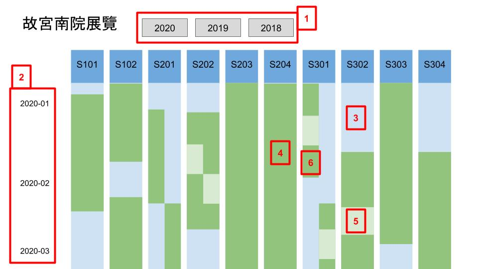

展覽廳使用紀錄 UI 設計
==========================

圖例
----

###  ###

## 說明 ##

1. 年分按鈕：切換顯示不同年的資料圖表。
2. 時間軸標籤。
3. 該展間在這段時間沒有展覽。
4. 該展間在這段時間有展覽且開放參觀，當滑鼠移游標動到這個物件上，出現新的 rectangle 顯示詳細展覽資料，離開時 rectangle 消失。
5. 該展間在這段時間有展覽，但關閉換展，當滑鼠移游標動到這個物件上，出現新的 rectangle 顯示詳細展覽資料，離開時 rectangle 消失。
6. 展覽只用一半的展間時，圖表寬度為一半。